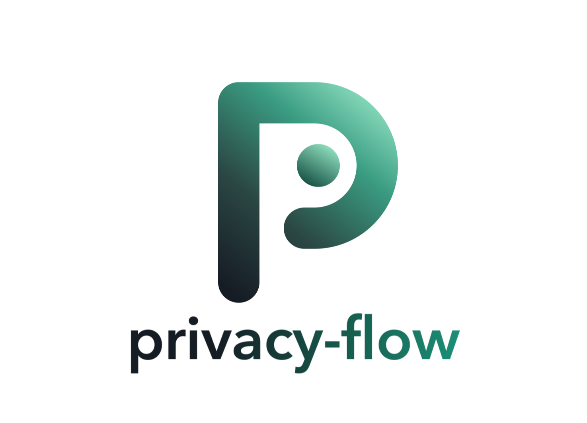
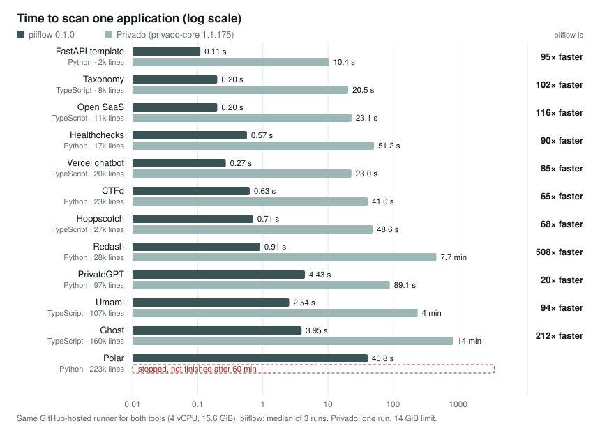

<p align="center">
  
</p>

# privacy-flow

Deterministic, offline static analysis of where personal data goes: logs, third-party SDKs, LLM providers and outbound HTTP. Cited file:line flow paths, SARIF, canonical JSON and Fides egress.

> **Where does the email address go?**
>
> A record of processing needs to know which processors receive personal data, and most GDPR
> findings in code review are flows, not columns: a request body logged in full, an email address
> passed to an analytics SDK, a customer record pasted into an LLM prompt. `piiflow` finds those
> flows and cites every hop. Offline, reproducible, no model.

[](https://github.com/noru-tech/privacy-flow/releases/latest)
[](https://github.com/noru-tech/privacy-flow/actions/workflows/ci.yml)
[](https://scorecard.dev/viewer/?uri=github.com/noru-tech/privacy-flow)
[](./LICENSE)
[](https://crates.io/crates/privacy-flow)
[](https://doi.org/10.5281/zenodo.23104908)

## Install

The binary is called `piiflow`; the package is `privacy-flow` everywhere.

### Homebrew

```bash
brew install noru-tech/tap/piiflow        # macOS and Linux
```

### crates.io

The crate is `privacy-flow` (the short names `pflow` on crates.io and on PyPI belong to unrelated
tools). The binary it installs is `piiflow`.

```bash
cargo binstall privacy-flow               # prebuilt binary from GitHub Releases
cargo install privacy-flow --locked
```

### Prebuilt binaries

Download an archive for your platform from
[GitHub Releases](https://github.com/noru-tech/privacy-flow/releases): fully static Linux builds
(`x86_64-unknown-linux-musl`, `aarch64-unknown-linux-musl`) and macOS builds
(`aarch64-apple-darwin`, `x86_64-apple-darwin`), each named `privacy-flow-<target>.tar.xz` and
holding `piiflow`, the README, the changelog, the licence and the notice.

### Verify before you run

Every archive carries a GitHub artifact attestation from the release workflow and a SHA-256
checksum file next to it (`<archive>.sha256`; `sha256.sum` lists all of them). Check both before
you unpack:

```bash
VERSION=v0.1.1
ARCHIVE=privacy-flow-aarch64-apple-darwin.tar.xz
gh release download "$VERSION" --repo noru-tech/privacy-flow \
  --pattern "$ARCHIVE" --pattern "$ARCHIVE.sha256"

# Built by this repository's release workflow, from a tagged commit
gh attestation verify "$ARCHIVE" --repo noru-tech/privacy-flow \
  --signer-workflow noru-tech/privacy-flow/.github/workflows/release.yml

# The bytes match the published checksum (on Linux: sha256sum -c "$ARCHIVE.sha256")
shasum -a 256 -c "$ARCHIVE.sha256"

tar -xJf "$ARCHIVE"
```

There is no `curl | sh` installer in these instructions, and there will not be one.

## Quick start

Try it on the demo in this repository, a sign-up function that logs, tracks and prompts:

```console
$ piiflow scan examples/demo -f table
PF001  medium   pf-117ae3a9dc330b87  src/users.ts:14:3
                user.contact.email from `user.email (user: User)` (src/users.ts:12) reaches a log sink (js.pino) at src/users.ts:14
PF002  high     pf-1951d7a5885d783b  src/users.ts:15:3
                user.contact.email from `user.email (user: User)` (src/users.ts:12) reaches PostHog, a processor not declared in .privacy-flow.yml, at src/users.ts:15
PF002  high     pf-25e5133d96887c7f  src/users.ts:17:9
                user.contact.phone_number from `user.phone_number (user: User)` (src/users.ts:12) reaches OpenAI, a processor not declared in .privacy-flow.yml, at src/users.ts:17
PF003  medium   pf-a064859c05ad24b5  src/users.ts:17:9
                user.contact.phone_number from `user.phone_number (user: User)` (src/users.ts:12) reaches OpenAI through a model call at src/users.ts:17

3 flow(s) from 2 source(s) to 3 sink(s); findings: PF001 1, PF002 2, PF003 1
processors reached: OpenAI, PostHog
coverage: complete
```

Scan a repository, see why, and enforce a policy:

```bash
piiflow scan .                            # writes .privacy-flow/flows.json
piiflow explain pf-0123456789abcdef       # every hop, with the source line of each
piiflow check .privacy-flow/flows.json    # exit 1 above the threshold, 4 with open coverage gaps
```

Or report the flows each pull request introduces, as code-scanning alerts, with the
[GitHub Action](docs/github-action.md):

```yaml
# .github/workflows/privacy-flow.yml
on: pull_request
permissions:
  contents: read
  security-events: write
jobs:
  privacy-flow:
    runs-on: ubuntu-latest
    steps:
      - uses: actions/checkout@v5
        with: { fetch-depth: 0 }
      - uses: noru-tech/privacy-flow@v0.1.1
```

<a id="what-it-does"></a>
## How do I find where personal data goes in my code?

Trace each value that holds personal data to every place it leaves the program, and cite the
chain: `piiflow` does that for TypeScript, JavaScript and Python, offline and deterministically,
and reports each path as a chain of `file:line:column` hops from the source to the sink.

```console
$ piiflow explain pf-a064859c05ad24b5
pf-a064859c05ad24b5 PF003 medium: user.contact.phone_number from `user.phone_number (user: User)` (src/users.ts:12) reaches OpenAI through a model call at src/users.ts:17
flow-1b97b0cc5aa9541b (user.contact.phone_number, call depth 2):
   1. source  src/users.ts:12:30
      user.contact.phone_number (typed_object: User.phone_number, field declared at src/users.ts:10; classified by classification-table)
         12 | export async function signup(user: User) {
   2. call    src/users.ts:16:18
      into format (parameter u)
         16 |   const prompt = format(user);
   3. read    src/format.ts:2:18
          2 |   return `Call ${u.phone_number} about ${u.plan}`;
   …
  11. sink    src/users.ts:17:9
      llm sink js.openai, processor OpenAI
         17 |   await openai.chat.completions.create({ model: 'gpt-4o', messages: [{ role: 'user', content: prompt }] });
```

The helper `format` does not use the email address, so the email address does not reach the
model: the flow through the helper is computed per argument and per field.

- **Sources** are reads of fields the [classification table](vendor/classification/classification.json)
  names (`user.email`, `customer.phone_number`), parameters named that way, objects typed with a
  type that declares such fields, request input in Express, Fastify, Next.js, FastAPI, Flask and
  Django, and fields from an existing Fides data map. Categories are
  [Fideslang](https://github.com/ethyca/fideslang) keys.
- **Sinks** are logs (console, pino, winston, Python logging, structlog …), error tracking
  (Sentry), product analytics (Segment, Mixpanel, PostHog, Amplitude), email and messaging
  (SendGrid, Postmark, Twilio, Nodemailer, Slack …), LLM providers (OpenAI, Anthropic, Gemini,
  Mistral, LangChain, the Vercel AI SDK), outbound HTTP (`fetch`, axios, `requests`, `httpx` …,
  with the host when it is a literal), browser storage, and other processors (Stripe, S3 …). Each
  names the processor that receives the data.
- **The analysis** is field-sensitive (`user.id` does not carry `user.email`), follows calls into
  the project's own functions through summaries (a helper called with an email address and with
  an ID does not mix them), across files, packages and `tsconfig` aliases, and is flow-insensitive
  within a function.
- **Unknown is reported as unknown.** A call the analysis cannot place, a framework it does not
  model, a file it could not parse: each is a [coverage gap](docs/rules/PFC01.md), and a result with
  open gaps never exits as clean.

### What is in this repository

| Piece | Where |
| --- | --- |
| **CLI** — `piiflow`: scan, diff, explain, check, validate, rules, doctor | [`src/`](src/) |
| **Catalogue** — sources, sinks, sanitisers, propagators, frameworks, as YAML | [`catalogue/`](catalogue/), [docs](docs/catalogue.md) |
| **Schemas** — flow-facts document (stable, versioned) and configuration (JSON Schema 2020-12) | [`schemas/`](schemas/) |
| **Rule pages** — one per rule, with controls, examples, fixes and dispositions | [`docs/rules/`](docs/rules/README.md) |
| **Outputs** — table, canonical JSON, SARIF 2.1.0 with code flows, Fides egress, in-toto, facts | [docs](docs/output.md) |
| **GitHub Action** — the flows a pull request introduces, as SARIF and a job summary | [`action.yml`](action.yml), [docs](docs/github-action.md) |
| **Conformance corpus** — programs with expected flows, and a runner any analyser can use | [`conformance/`](conformance/README.md) |
| **Design** — how it works, and an ADR per major choice | [design](docs/design.md), [ADRs](docs/adr/README.md) |
| **Benchmark** — piiflow against Privado on twelve real applications, and what is not measured yet | [report](benchmark/REPORT.md) · [method](docs/benchmark.md) |

<!-- speed:start -->

## How fast is it?

**On the same machine, piiflow scanned each application in 0.11 s to 40.8 s, using at most 624 MiB of memory. Privado took 10.4 s to 14 min and up to 10.6 GiB, and had not finished Polar after 60 min.** Half the applications ran more than 94 times faster with piiflow.



| Application | Lines of code | piiflow | Privado | piiflow memory | Privado memory |
| --- | ---: | ---: | ---: | ---: | ---: |
| [FastAPI template](https://github.com/fastapi/full-stack-fastapi-template) | 1,520 | 0.11 s | 10.4 s | 14 MiB | 1.3 GiB |
| [Taxonomy](https://github.com/shadcn-ui/taxonomy) | 7,788 | 0.20 s | 20.5 s | 22 MiB | 759 MiB |
| [Open SaaS](https://github.com/wasp-lang/open-saas) | 10,774 | 0.20 s | 23.1 s | 23 MiB | 1.3 GiB |
| [Healthchecks](https://github.com/healthchecks/healthchecks) | 17,110 | 0.57 s | 51.2 s | 30 MiB | 2.8 GiB |
| [Vercel chatbot](https://github.com/vercel/chatbot) | 20,446 | 0.27 s | 23.0 s | 32 MiB | 2.3 GiB |
| [CTFd](https://github.com/CTFd/CTFd) | 23,488 | 0.63 s | 41.0 s | 35 MiB | 3.7 GiB |
| [Hoppscotch](https://github.com/hoppscotch/hoppscotch) | 27,376 | 0.71 s | 48.6 s | 47 MiB | 2.4 GiB |
| [Redash](https://github.com/getredash/redash) | 27,804 | 0.91 s | 7.7 min | 49 MiB | 10.6 GiB |
| [PrivateGPT](https://github.com/zylon-ai/private-gpt) | 96,645 | 4.43 s | 89.1 s | 133 MiB | 4.6 GiB |
| [Umami](https://github.com/umami-software/umami) | 107,365 | 2.54 s | 4 min | 152 MiB | 4.5 GiB |
| [Ghost](https://github.com/TryGhost/Ghost) | 160,029 | 3.95 s | 14 min | 192 MiB | 6.3 GiB |
| [Polar](https://github.com/polarsource/polar) | 222,747 | 40.8 s | not finished after 60 min | 624 MiB | 12.8 GiB |

**How this was measured** (2026-10-02). The 12 open-source applications of the [benchmark corpus](benchmark/SELECTION.md); each one on its own GitHub-hosted runner (4 vCPU, 15.6 GiB; 4 different CPU models across jobs, listed in [results.json](benchmark/speed/results.json)), with both tools run one after the other on it. piiflow 0.1.0 is the released Linux binary, verified by its attestation; the median of 3 runs is shown, and its output matched the recorded macOS run byte for byte on every application. Privado is privado-core 1.1.175 from its pinned image with its newest rules, offline, one run, 14 GiB limit. This measures speed and memory only; whether each tool's findings are *right* is measured by the [labelled benchmark](benchmark/REPORT.md), which is in progress. [Method and how to rerun it](benchmark/speed/README.md).

<!-- speed:end -->

<a id="what-it-is-not"></a>
## What does piiflow not do?

It does not find security vulnerabilities, scan data at rest or in databases, observe the running
system, or decide purposes, legal bases or data subjects: those stay human (or Noru) judgements.
It never calls a model, makes no network calls, and sends no telemetry. A clean result is a
statement about the scanned scope, with its gaps listed, not a compliance certification.

The analysis is flow-insensitive within a function, follows plain objects one field deep, and
supports TypeScript, JavaScript and Python with the frameworks listed above. Everything it does
not cover is in [KNOWN-LIMITATIONS.md](KNOWN-LIMITATIONS.md); what comes next is in the
[roadmap](ROADMAP.md).

<a id="rules"></a>
## Which rules does piiflow check?

Each rule has a page that explains it, maps it to controls, shows a failing and a passing example
and says how to fix it or record a disposition ([all rules](docs/rules/README.md)):

| ID | Finding | Default severity |
| --- | --- | --- |
| [PF001](docs/rules/PF001.md) | Personal data reaches a log sink | medium |
| [PF002](docs/rules/PF002.md) | Personal data reaches a third-party processor not declared in config | high |
| [PF003](docs/rules/PF003.md) | Personal data reaches an LLM provider | medium |
| [PF004](docs/rules/PF004.md) | Special-category data (Art. 9 or 10) reaches an external sink | high |
| [PF005](docs/rules/PF005.md) | Credentials or authentication data reach a log or third party | high |
| [PF006](docs/rules/PF006.md) | Personal data reaches outbound HTTP with a non-literal host | warning |
| [PFC01](docs/rules/PFC01.md) | Coverage gap: unsupported framework, dynamic dispatch or depth bound reached | warning |

Declaring a processor in `.privacy-flow.yml` (with a citation to the DPA or vendor record) turns
PF002 into an informational egress fact: that is how the tool fits a team that already keeps a
processor list. The [control mapping](docs/control-mapping.md) is pending review by a privacy
lawyer or Noru's compliance lead.

## Commands

| Command | What it does |
| --- | --- |
| `piiflow scan [PATH]` | Analyse and write findings and flow facts (default `.privacy-flow/flows.json`) |
| `piiflow diff BASE..HEAD [PATH]` | Report only flows introduced or changed between two revisions (`BASE..` compares with the working tree) |
| `piiflow explain ID` | Print a finding's (or flow's, or gap's) hop chain with the source line of each hop |
| `piiflow check FILE` | Enforce policy and dispositions (`--as-of DATE`, `--fail-on`); exit 1 on failure |
| `piiflow validate FILE` | Re-check a document or in-toto Statement: schema, digest, derived findings |
| `piiflow rules` | List the loaded catalogue, its version and every source, sink, sanitiser and propagator |
| `piiflow doctor [PATH]` | Show detected languages, frameworks, configuration and coverage before a scan |
| `piiflow completions SHELL` / `piiflow manpage DIR` | Shell completions and man pages |

Global flags: `-q` silences status lines; `--threads N` sets worker threads (the output is the same
for every value).

## Output formats and exit codes

`--format table|json|sarif|fides|in-toto|facts` and `--output FILE`; the format is inferred from
the file name when omitted (`.sarif`, `.json`, `.yml`, `.intoto.json`, `.jsonl`). JSON is
[RFC 8785](https://www.rfc-editor.org/rfc/rfc8785) canonical bytes and carries a SHA-256 digest
that `validate` recomputes ([output](docs/output.md)).

| Code | Meaning |
| --- | --- |
| 0 | Success, or the policy threshold passed |
| 1 | Policy threshold exceeded (`check`) |
| 2 | Invalid command-line arguments |
| 3 | Invalid input: configuration or document |
| 4 | Coverage incomplete: a clean result cannot be claimed (takes precedence over 1) |

What each code means and what to do about it: [exit codes](docs/exit-codes.md).

## Configuration

`.privacy-flow.yml` declares processors, extra sources, sinks and sanitisers (each with a
citation), field names, names that are not personal, exclusions and policy, validated against
[a published schema](schemas/config.schema.json). See [configuration](docs/configuration.md) and
[`examples/.privacy-flow.yml`](examples/.privacy-flow.yml).

## Conformance

The [conformance corpus](conformance/README.md) is a set of small programs with hand-written
expected flows and an external-runner contract (`<cmd> <vector-dir>`, flows as JSON lines on
stdout), so any analyser can be scored against it:

```bash
python3 conformance/run.py --verifier "piiflow -q scan --walk -f facts"
```

## Development

```bash
cargo build
cargo test            # unit, CLI, fixtures, conformance, determinism goldens, principles
cargo clippy --all-targets -- -D warnings
cargo bench           # criterion benchmarks, including the engine comparison
```

See [CONTRIBUTING.md](CONTRIBUTING.md) for the layout, how to add an SDK to the catalogue, and how
goldens are updated.

## How to cite

Every release from 0.1.1 on is archived on Zenodo. Cite the concept DOI
[10.5281/zenodo.23104908](https://doi.org/10.5281/zenodo.23104908), which resolves to the latest
release, or the version DOI of the release you used, listed on that record, when the exact bytes
matter (an audit report, a benchmark, or a conformance claim). `CITATION.cff` has the citation
metadata.

## Trust

How a release gets from this repository to your machine, and how to check it:

- **Built in CI, from a tag.** Releases are built by [cargo-dist](https://github.com/axodotdev/cargo-dist)
  in GitHub Actions ([release.yml](.github/workflows/release.yml)) from the tagged commit.
- **Attested.** Every archive has a GitHub artifact attestation (SLSA build provenance, signed
  through Sigstore) naming the workflow and commit that built it; see
  [Verify before you run](#verify-before-you-run).
- **Checksums and SBOM.** Each archive has a `.sha256` file, `sha256.sum` lists them all, and a
  CycloneDX SBOM is attached to every release.
- **Offline by construction.** No network crate is a dependency, and a test fails if one is added
  or if the source opens a socket or starts a process other than `git`.
- **Pinned and scored.** Every GitHub Action is pinned to a commit SHA and kept current by
  Dependabot; supply-chain posture is measured by
  [OpenSSF Scorecard](https://scorecard.dev/viewer/?uri=github.com/noru-tech/privacy-flow).
- **Vulnerabilities.** Report privately through
  [GitHub private vulnerability reporting](https://github.com/noru-tech/privacy-flow/security/advisories/new);
  see [SECURITY.md](SECURITY.md).

## Relationship to Noru

`piiflow` is standalone and needs no Noru account. Parsing, the intermediate representation, the
flow analysis, the catalogue, the rules and every output format are open, here; purpose and
legal-basis inference, record-of-processing assembly and cross-repository topology are Noru's
([NOTES.md](NOTES.md) records the line). privacy-datamap can read the flow facts to fill processor
and egress fields in a data map, and ai-inventory can read PF003 facts to answer "what data reaches
the model"; the flow-facts schema is stable and versioned for them.

## License

MIT, see [LICENSE](./LICENSE). The tool, the catalogue, the schemas and the conformance corpus are
MIT-licensed and independent of the Noru platform. The vendored Fideslang taxonomy is © Ethyca,
Inc. under CC BY 4.0; see [NOTICE](NOTICE).

Maintained by [Noru](https://noru.tech), a continuous compliance platform.
