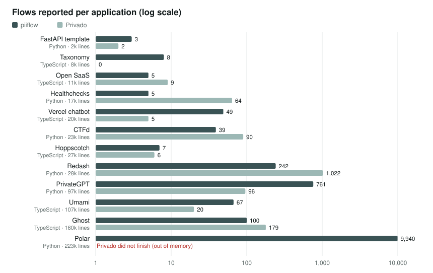
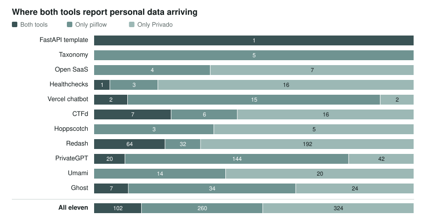
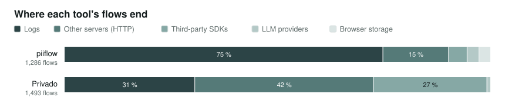
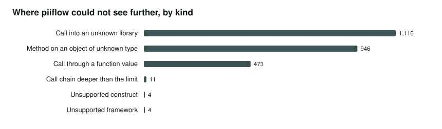

# piiflow and Privado, on code neither was built for

<!-- Generated by benchmark/report/markdown.py from benchmark/results/overview.json; do not edit by hand. -->

Two static analysers that look for personal data leaving an application: into logs, third-party services, LLMs and other servers. Both ran on the same twelve open-source applications. Two people now check, by hand and without knowing which tool said what, whether each reported flow is real and which real ones each tool missed.

**Status: waiting for the labels.** 0 of 1,552 labels done (776 items, each labelled by both reviewers). Until then nothing here says which tool is more accurate; the counts below show what each tool reports.

**Version tested: piiflow 0.1.0**, released 2026-10-02. The released binary reproduces all 12 applications' results byte for byte, so these are the numbers you get when you install it. Speed and memory are in the [README](../README.md#how-fast-is-it).

## The comparison

Measured on the eleven applications both tools completed. Privado could not finish Polar, so it is left out for both tools.

| Question | piiflow | Privado |
| --- | --- | --- |
| Right when it reports a flow | waiting for labels | waiting for labels |
| Finds the real flows | waiting for labels | waiting for labels |
| Finds them, or flags the place it could not see | waiting for labels | does not flag |
| Right, counting only its findings (not its “maybe personal” reports) | waiting for labels | no such split |

## How to read the numbers

- **Right when it reports a flow.** Of the flows a tool reports, the share a reviewer confirms: the data can really get from where it is read to where it is sent, and it really is personal data. High means few false alarms.
- **Finds the real flows.** Of the places that really send personal data out, the share where the tool reports a flow. The places are a random sample of every call that looks like logging, an API or an SDK, checked by hand. High means little is missed.
- **Flags what it cannot see.** piiflow also reports places where its analysis stopped (an unknown library, a dynamic call). A real flow behind such a place is not found, but it is not hidden either: someone is told to look. Privado reports nothing comparable.
- **The range after each number.** Every number comes from a sample, so it has a 95 % confidence range: the true value is very likely inside it. When the two tools' ranges overlap, the difference may be chance.

## Is the comparison fair?

In its favour:

- **Same code for both.** The same applications at the same commits and the same folders. Each tool leaves out tests and generated code by its own default rules, which are close but not identical.
- **Chosen before either tool ran.** Open-source applications under permissive licences, picked by written rules; every rejected candidate is listed with the reason ([SELECTION.md](SELECTION.md)). piiflow was not developed or tuned on any of them.
- **Checked blind.** Each reviewer labels alone. Flows from both tools are shown in the same format and shuffled together, so a reviewer cannot tell which tool reported which.
- **Privado at its best.** Its newest rules, run offline from a pinned image, without the telemetry its command-line tool sends.

Its limits:

- **Privado finished eleven of twelve.** It did not finish Polar in any attempt: killed for exceeding its memory, or still running after an hour (every attempt is recorded in [results/privado](results/privado/)). Both tools are compared on the eleven it finished.
- **Privado calls its JavaScript and TypeScript support beta.** Half the applications are TypeScript. That is part of what is being measured; the full results are also broken down by language.
- **Not compared:** how each tool names the kind of data (the two vocabularies only partly line up). Speed is compared separately, on one machine, in the [README](../README.md#how-fast-is-it).

Everything is fixed in writing before labelling, with every later change recorded: [PROTOCOL.md](PROTOCOL.md).

## What the tools reported

Counts from the runs, before any checking. They show where each tool looks and how often they agree, not whether they are right.

- **They rarely point at the same place.** Of 686 places where at least one tool reports personal data arriving, they agree on 102 (15 %). At most of the rest one of them is wrong; the labels decide which.
- **piiflow reports far more.** 11,226 flows against Privado's 1,493. 89 % of piiflow's come from one large application, Polar, mostly log lines.
- **Many of piiflow's reports are tentative.** 66 % start from a field whose name is only possibly personal, such as `name`. piiflow marks those for review rather than as findings, which is why the comparison shows it both ways.
- **piiflow says where it is blind.** 2,554 places across the applications where its analysis stopped. Every scan ends with “coverage incomplete” rather than a clean result.

## The applications

| Application | Language | Framework | Lines | piiflow flows | Blind spots | Privado flows |
| --- | --- | --- | ---: | ---: | ---: | ---: |
| [FastAPI template](https://github.com/fastapi/full-stack-fastapi-template) | Python | FastAPI | 1,520 | 3 | 9 | 2 |
| [Taxonomy](https://github.com/shadcn-ui/taxonomy) | TypeScript | Next.js (App Router and Pages API routes) | 7,788 | 8 | 5 | 0 |
| [Open SaaS](https://github.com/wasp-lang/open-saas) | TypeScript | Wasp (not modelled by piiflow) | 10,774 | 5 | 14 | 9 |
| [Healthchecks](https://github.com/healthchecks/healthchecks) | Python | Django | 17,110 | 5 | 58 | 64 |
| [Vercel chatbot](https://github.com/vercel/chatbot) | TypeScript | Next.js App Router | 20,446 | 49 | 51 | 5 |
| [CTFd](https://github.com/CTFd/CTFd) | Python | Flask | 23,488 | 39 | 75 | 90 |
| [Hoppscotch](https://github.com/hoppscotch/hoppscotch) | TypeScript | NestJS (not modelled by piiflow) | 27,376 | 7 | 89 | 6 |
| [Redash](https://github.com/getredash/redash) | Python | Flask | 27,804 | 242 | 139 | 1,022 |
| [PrivateGPT](https://github.com/zylon-ai/private-gpt) | Python | FastAPI | 96,645 | 761 | 273 | 96 |
| [Umami](https://github.com/umami-software/umami) | TypeScript | Next.js App Router | 107,365 | 67 | 307 | 20 |
| [Ghost](https://github.com/TryGhost/Ghost) | TypeScript | Express | 160,029 | 100 | 619 | 179 |
| [Polar](https://github.com/polarsource/polar) | Python | FastAPI | 222,747 | 9,940 | 915 | did not finish |

## What the reviewers label

Samples are drawn by a fixed rule, so anyone can draw the same ones and check the labels ([REVIEWERS.md](REVIEWERS.md)).

| Application | piiflow flows | Privado flows | Blind spots | Call sites | Items | Reviewer 1 | Reviewer 2 |
| --- | ---: | ---: | ---: | ---: | ---: | ---: | ---: |
| FastAPI template | 3 | 2 | 9 | 15 | 29 | 0 of 29 | 0 of 29 |
| Taxonomy | 3 | 0 | 5 | 10 | 18 | 0 of 18 | 0 of 18 |
| Open SaaS | 5 | 9 | 10 | 30 | 54 | 0 of 54 | 0 of 54 |
| Healthchecks | 4 | 16 | 10 | 30 | 60 | 0 of 60 | 0 of 60 |
| Vercel chatbot | 24 | 5 | 10 | 30 | 69 | 0 of 69 | 0 of 69 |
| CTFd | 19 | 16 | 10 | 30 | 75 | 0 of 75 | 0 of 75 |
| Hoppscotch | 7 | 6 | 10 | 30 | 53 | 0 of 53 | 0 of 53 |
| Redash | 36 | 24 | 10 | 30 | 100 | 0 of 100 | 0 of 100 |
| PrivateGPT | 30 | 16 | 10 | 30 | 86 | 0 of 86 | 0 of 86 |
| Umami | 10 | 10 | 10 | 30 | 60 | 0 of 60 | 0 of 60 |
| Ghost | 29 | 22 | 10 | 30 | 91 | 0 of 91 | 0 of 91 |
| Polar | 41 | 0 | 10 | 30 | 81 | 0 of 81 | 0 of 81 |
| **Total** | 211 | 126 | 114 | 325 | 776 | 0 of 776 | 0 of 776 |

---

Benchmark run recorded at piiflow commit `9a78b08`, whose analysis code is identical to the v0.1.0 release; output byte-identical on every rerun. Privado: privado-core 1.1.175 from a pinned image, newest rules (v1.3.91), networking off. Regenerate with `python3 benchmark/overview.py && python3 benchmark/report/markdown.py`.
